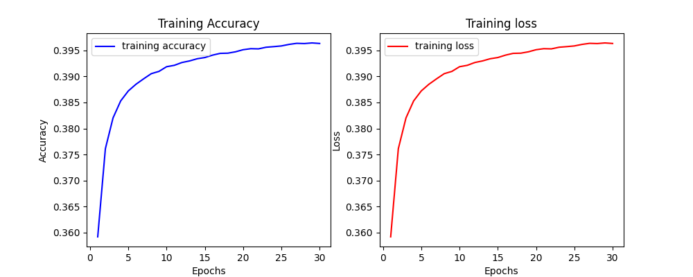
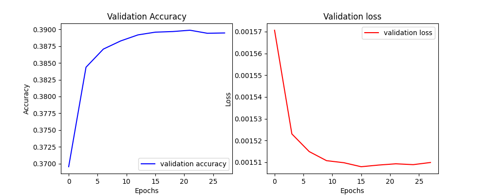
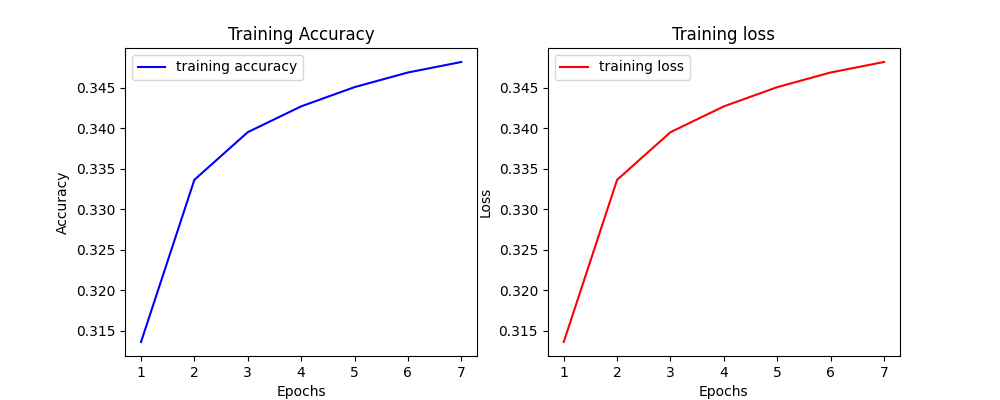
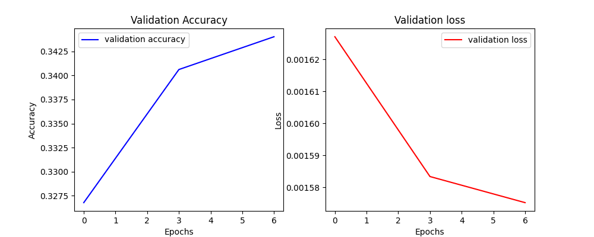
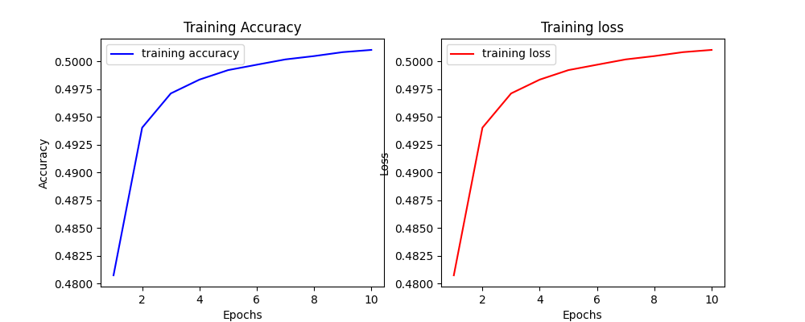
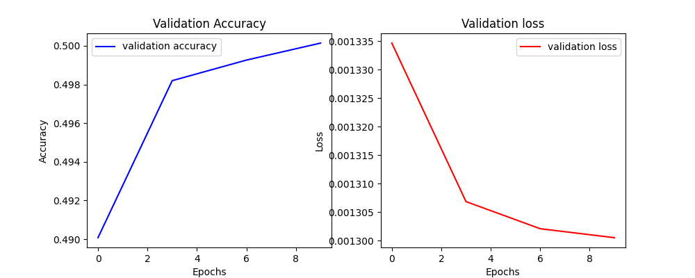

# Implementation
- In this code CBOW was implemented with a 128 embedding dim and 128 hidden dime connected to a fully connected layer that is the same size of the vocab, and using cross entropy as the loss function.

		CBOW(
		(embed): Embedding(3000, 128)
		(linear1): Linear(in_features=128, out_features=128, bias=True)
		(linear2): Linear(in_features=128, out_features=3000, bias=True)
		)

# Results
- There wasn't alot of hyperparameter tuning except for how to choose the embedding space of the vocab words, and the optimization alogrithm. The first was choosen following the power of 2 convention used in CS applications, the latter was chosen because the SGD wasn't always stable terms of gradient decent (accuracy get's stuck sometimes), however, Adam was much stable accross multiple tests.

## In Vitro

1- The first test was done with a context_size = 4 and 30 epochs, after the 10th epoch the training accuracy didn't increase much, stablizing around 0.4, same as well with the validation accuracy. Plots shared below

2- The second test was done with a context size = 2 and 7 epochs, the reason of decreasing the number of epochs is the limited time that I had. The training and validation accuracy were around 0.34. 

### Discussion

- We can see that the accuracy of the context_size = 4 is higher than the context_size = 2, though a bigger context is a harder task. The reason behind that the way I formulated the context. So, a target word has at least one context word that is not `<pad>` then it is going to be added in the input/output tensors data. So, this means I can have a context like (`I'm`, `<pad>`, `<pad>`, `<pad>`) which makes the prediction task easier for large context sizes. On the contrary, the smaller context that equals 2 will have less padding in it's input/output tensors data. What supports my argument is when I tried with context size = 8 my train/val accuracy jumped to 0.5 as in the pic below

## In Vivo

There are 3 metric measures used in this part of the evaluation. Exact, Mean Reciprocal Rank (MRR), MR (don't know stands for what). The definition of each is below: 
- ِ**Exact**: measures how many matches were in the first index of the result list, which means that the word2vec found the expected match as the first result of the query. Cons of this measure that it depends on how accurate our true dataset is, so if there are other words that can be an exact match as well this measure won't display an accurate result.
- MRR, measures all the query reuslts in the list with a reverse rank order of the result in the list. So, the further the result is the less MRR is going to be. If the model performs very poor this score is going to be close to zero, otherwise around 1 if the model performs well.
- MR, measures total/correct, which seems as a variance measure. In other words, how spread are the matching words in the query list. So, if we had a very good model and total = correct the result is going to be closer to 1. If we had a very poor model, correct is going to be a fraction which means the matched results are further in the query's reuslt list; consequently MR score going to be higher.

### Discussion

Below is the result of the in-vivo evaluation, I was suspecting that the small context window (size = 2) model will perform better on "syn" relation type, but context window 4 performed better on all levels except on `denonym`. Maybe the reason of why size 4 performed better is that size 2 is too small to capture syn relations. That's why I tried Window size = 8 but it didn't perform better than window size = 4 and I guess the reason is the paddings that I kept in the context (explained in the previous discussion). A better approach is going to be only having context as an input/output tensor if there isn't any padding. I didn't have time to try that out. 

### Context Size 4

	...Total performance across all 1309 analogies: 0.0168 (Exact); 0.0352 (MRR); 28 (MR)
	...Analogy performance across 969 "sem" relation types: 0.0062 (Exact); 0.0188 (MRR); 53 (MR)
		relation			N	exact	MRR		MR
		capitals			1	0.0000	0.0667	15
		binary_gender		12	0.0833	0.2418	4
		antonym				54	0.0370	0.0555	18
		member				4	0.2500	0.2750	4
		hypernomy			542	0.0037	0.0144	69
		similar				117	0.0000	0.0111	90
		partof				29	0.0000	0.0153	65
		instanceof			9	0.0000	0.0144	70
		derivedfrom			133	0.0000	0.0070	143
		hascontext			32	0.0000	0.0100	100
		relatedto			10	0.0000	0.0016	630
		attributeof			11	0.0000	0.0084	118
		causes				6	0.0000	0.0132	76
		entails				9	0.0000	0.0054	185
	...Analogy performance across 340 "syn" relation types: 0.0471 (Exact); 0.0817 (MRR); 12 (MR)
		relation			N	exact	MRR		MR
		adj_adv				22	0.0000	0.0088	114
		comparative			7	0.1429	0.2051	5
		superlative			3	0.0000	0.0377	27
		present_participle	62	0.0161	0.0514	19
		denonym				2	0.0000	0.0000	inf
		past_tense			64	0.0469	0.1114	9
		plural_nouns		107	0.0561	0.0923	11
		plural_verbs		73	0.0685	0.0803	12

### Context Size 2

	...Total performance across all 1309 analogies: 0.0061 (Exact); 0.0152 (MRR); 66 (MR)
	...Analogy performance across 969 "sem" relation types: 0.0021 (Exact); 0.0092 (MRR); 108 (MR)
		relation		N	exact	MRR		MR
		capitals		1	0.0000	0.0147	68
		binary_gender	12	0.0833	0.1502	7
		antonym			54	0.0000	0.0161	62
		member			4	0.0000	0.0060	165
		hypernomy		542	0.0000	0.0054	186
		similar			117	0.0085	0.0163	61
		partof			29	0.0000	0.0033	302
		instanceof		9	0.0000	0.0056	180
		derivedfrom		133	0.0000	0.0057	176
		hascontext		32	0.0000	0.0135	74
		relatedto		10	0.0000	0.0014	713
		attributeof		11	0.0000	0.0037	268
		causes			6	0.0000	0.0011	878
		entails			9	0.0000	0.0027	377
	...Analogy performance across 340 "syn" relation types: 0.0176 (Exact); 0.0324 (MRR); 31 (MR)
		relation			N	exact	MRR		MR
		adj_adv				22	0.0000	0.0086	117
		comparative			7	0.0000	0.0188	53
		superlative			3	0.0000	0.0007	1440
		present_participle	62	0.0000	0.0242	41
		denonym				2	0.0000	0.0029	340
		past_tense			64	0.0156	0.0317	32
		plural_nouns		107	0.0374	0.0440	23
		plural_verbs		73	0.0137	0.0335	30

### Context Size 8

	...Total performance across all 1309 analogies: 0.0015 (Exact); 0.0086 (MRR); 117 (MR)
	...Analogy performance across 969 "sem" relation types: 0.0010 (Exact); 0.0072 (MRR); 138 (MR)
		relation			N	exact	MRR		MR
		capitals			1	0.0000	0.0000	inf
		binary_gender		12	0.0000	0.0167	60
		antonym				54	0.0000	0.0028	359
		member				4	0.0000	0.0008	1213
		hypernomy			542	0.0000	0.0080	125
		similar				117	0.0000	0.0027	375
		partof				29	0.0000	0.0028	360
		instanceof			9	0.0000	0.0259	39
		derivedfrom			133	0.0000	0.0040	249
		hascontext			32	0.0000	0.0026	389
		relatedto			10	0.1000	0.1002	10
		attributeof			11	0.0000	0.0004	2726
		causes				6	0.0000	0.0029	346
		entails				9	0.0000	0.0048	206
	...Analogy performance across 340 "syn" relation types: 0.0029 (Exact); 0.0124 (MRR); 81 (MR)
		relation			N	exact	MRR		MR
		adj_adv				22	0.0000	0.0009	1152
		comparative			7	0.0000	0.0201	50
		superlative			3	0.0000	0.0016	628
		present_participle	62	0.0000	0.0212	47
		denonym				2	0.0000	0.0018	557
		past_tense			64	0.0000	0.0151	66
		plural_nouns		107	0.0000	0.0032	310
		plural_verbs		73	0.0137	0.0194	51